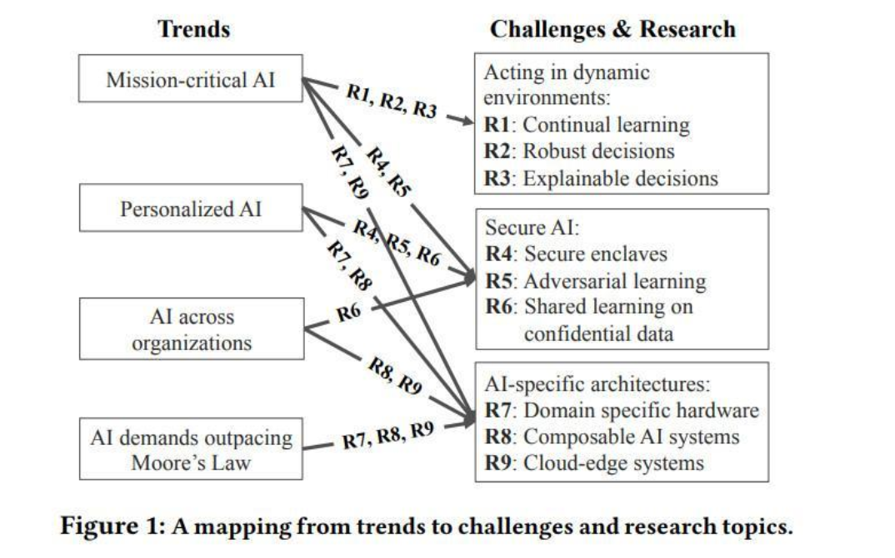

************
神经网络基础
************

.. graphviz::

   digraph G {
       rankdir=LR
          
       Memory1->Predict[label="feature1:Color"]
          
       Memory2->Predict [label="feature2:Construct"]
          
       Memory3->Predict [label="feature2:3D information"]
          
       Memory4->Predict [label="feature3:spatial and time seires information"]
          
       Predict->Output
   
   }

基本概念
========

激活函数 
   主要的错误，就像一个哈希函数，把一个任意大小的输入映射到固定区间的大小的数据
   常见的函数有: ReLu ,Sigmoid,Binary,Softplus,SoftMax,Maxout 等以及相关的变型，差不多20多种。
   相当于一个压缩变换，现在最新的还有 SELU,自归一化神经网络SNN,它在训练误差上，并没有高方差，并且令激励值
   达到0均值和单位方差，从而达到和批归一化类似的效果，也避免了梯度爆炸与梯度消失。
   http://blog.csdn.net/zijin0802034/article/details/77334144
  
   .. image:: /Stage_2/selu.png   
     

后向传播
   主要是反馈网络的计算，这包含两个LossFunction的计算，以及如何用LossFunction来更新W参数。
   主要有梯度法。
   Cost/Loss 函数 主要来度量预测值与标准值之间测度。单个值对的比较有有时候没有意义。
   例如二值判断，是没有办法来用距离来判断的，怎么办呢，其实是采用集合的正确率，这样一个统计值来计算出
   可以量化的距离值来计算loss.

   - MLE(Maximum LikeHood Estimation). 
   - Cross-Entory
   - logistic
   - Quadratic
   - 0-1 Loss
   - Hinge Loss
   - Expontenial
   - Hellinger Distance
   - Kullback-Leibler Divengence
   - https://stats.stackexchange.com/questions/154879/a-list-of-cost-functions-used-in-neural-networks-alongside-applications
   - https://en.wikipedia.org/wiki/Loss_functions_for_classification

learningRate
   参数的步进的速度，来解决振荡的问题。最好用的应该是AdaGrad,自适应调整。

前向传播
   也就是正常推理计算，基本上者就是矩阵乘

训练的优化
==========

#. Gradient Descent
#. SGD 来解决计算量太大的问题，每一次随机抽取一块来更新,并且解决陷入局部最优的问题。
#. Momentum 根据上次的变量来加权更新当前的值 
#. Adagrad 也就是适应调整每一个参数

参数初始化
==========

#. 常量初始化，例如全0初始化，全1的初始化。
#. Small Random Numbers
#. calibrating the Variances 最好可以根据输入的结构来调整 
   
神经元
======

:math:`y=f(\sum{W}*X +b)`

输入层
======

把各种样的输入，映射到神经网络。当然各个输入之间相互独立是最好的。
一般都是 :math:`(X,y)` X是多维的，y是一维的，也可能 y也是多维的。

Batch Nomalization
==================

输入正则化，并且每一次正则化一部分，也可以提前预处理全部的数据。

输入正则化的好处在于，把非线性关系，变成了线性。

:math:`Y=a_{n} *g_{n}(x)`
正则化相当于把 :math:`Y=a_{n} *x_{n}` 也就是所有关系转化为了最基本的加乘关系。
不然由于不同因素的变化范围与相对量的不同。也就导致前面的系数的不稳定。

Instance Normalization
======================

batch norm是对一个batch里所有的图片的所有像素求均值和标准差。而instance norm是对单个图片的所有像素求均值和标准差。这里其实可以看到的一个问题，由于shuffle的存在，每个batch里每次的均值和标准差是不稳定，本身相当于是引入了噪声。而instance norm的信息都是来自于自身的图片，某个角度来说，可以看作是全局信息的一次整合和调整。对于训练也说也是更稳定的一种方法。其实我们完全可以把instance norm当做L2 norm这种方法的一个变种。前者适合卷积层，后者适合全连接层。仅个人意见，可能存在各种问题，欢迎大神补充讨论。

链接：https://www.zhihu.com/question/68730628/answer/266733274

.. image:: /Stage_2/normalization.svg

x,y是某一层的输出，另外都是统计参数，两个scale以及offset. 

#. instance normalization 单个sample
#. batch normalization, batch 内平均
#. batch renormalization  batch 权重平均例如softmax,softmean

cost函数 
========

不同cost函数求导等一些性质也都不一样，也导致了训练效率的问题，例如交叉熵的好像，能够避免signoid函数的在极值情况下减速问题。
原因就是由于其导数结构。自然对数的导数求导，还是自然导数这个特殊的性质。
https://hit-scir.gitbooks.io/neural-networks-and-deep-learning-zh_cn/content/chap3/c3s1.html

网络的组成，可以都由一类函数来代替与输入加相关的函数来替换，特别是物理学中相关的核函数。 

隐藏层
======
   
输出层
======

Regularization
==============

#. L1 norm
#. L2 norm
#. Eearly Stopping
#. Dropout
#. Sparse regularization on columns
#. Nuclear norm regularization
#. Mean-constrained regularization
#. Cluster mean-constrained regularization
#. Graph-base similarity 

bias
====

.. image:: /Stage_2/biasVariance.png

网络结构
========

#. Forward
#. LSTM
#. GAN
#. Auto-Encoders
#. CNN
#. RNN(Recurrant)
#. RNN(Recursive) 

自动适配其实也简单，直接根据规则构造生成一个矩阵，然后那就是构造其系数，其中一个方法，那就是通过训练。其实人们平时不断重复同一个动作也是一样的。

如何开始
========

#. 针对问题，选一个合适的网络结构
#. 看看这个framework的实现有没有bugs 在梯度检查时。
#. 参数初始化
#. 优化
#. 检验模型的有效性
   
   - 如果无效，改变model structure 或者改大网络拓扑
   - overfit, Regularize to prevvent overfitting
      
     * Reduce modle size
     * l1/l2 on weights
     

#. 持续学习
#. 鲁棒决策
#. 可解决的决策
#. 安全飞地
#. 对抗学习
#. 在保密数据上共享学习
#. 为特定领域定制的硬件
#. 组件化的AI系统 
#. 跨云端和边界的系统 

一个看不出来规律，那就弄多个来对比，就像周易的演化一样。然后再平均，然后权重平均(又分线性分段，又分非线分段)，简单权重平均还还行的话，那就要非线性的加权。 
也就是所谓的压缩变换。如何实现一个最合理的非线性加权，当然是网络函数最合适了。或者用理论来解释。

参考
====

#. https://github.com/dformoso/deeplearning-mindmap
#. http://www.cnblogs.com/daniel-D/archive/2013/06/03/3116278.html BP 算法之一种直观的解释
#. `深度学习wiki <http://deeplearning.stanford.edu/wiki/index.php/%E7%A5%9E%E7%BB%8F%E7%BD%91%E7%BB%9C>`_  

#. `神经网络基础 <ttp://blog.csdn.net/zouxy09/article/details/9993371>`_
#. `蜜蜂能够认出你 <http://www.huanqiukexue.com/html/newqqkj/newsm/2014/0409/24296.html>`_  蜜蜂在如此脑容量小的情况下能够认出人脸，有什么启发？

#. `L1,L2 正则化 <http://freemind.pluskid.org/machine-learning/sparsity-and-some-basics-of-l1-regularization/>`_

#. `SDA <http://deeplearning.net/tutorial/SdA.html#sda>`_
#. `人工智能的未来 <http://blog.csdn.net/zouxy09/article/details/8782018>`_

#. `L1 Norm 稀疏性原理 <http://blog.sina.com.cn/s/blog_49b5f5080100af1v.html>`_
#. `import gzip 模块 压缩文件 <http://docs.python.org/2/library/gzip.html>`_  
#. `拉格朗日乘数 <http://zh.wikipedia.org/wiki/&#37;E6&#37;8B&#37;89&#37;E6&#37;A0&#37;BC&#37;E6&#37;9C&#37;97&#37;E6&#37;97&#37;A5&#37;E4&#37;B9&#37;98&#37;E6&#37;95&#37;B0>`_
#. `LDA-math-MCMC 和 Gibbs Sampling <http://cos.name/2013/01/lda-math-mcmc-and-gibbs-sampling/>`_  

#. `卷积神经网络: <http://blog.csdn.net/zouxy09/article/details/8775360>`_  
#. `LDA-math-MCMC 和 Gibbs Sampling <http://cos.name/2013/01/lda-math-mcmc-and-gibbs-sampling/>`_  gibbs 采样
